# 🛡️ Awesome Managed Detection & Response (MDR) Ecosystem

<p align="center">
  
</p>

<p align="center">
  <a href="https://github.com/ishandutta2007/Awesome-Awesome-Awesome"></a>
  <a href="https://discord.gg/jc4xtF58Ve"></a>
  <a href="https://github.com/ishandutta2007/Awesome-Managed-Detection-n-Response/stargazers"></a>
  <a href="https://github.com/ishandutta2007/Awesome-Managed-Detection-n-Response/network/members"></a>
  <a href="https://github.com/ishandutta2007/Awesome-Managed-Detection-n-Response/blob/main/LICENSE"></a>
  <a href="https://github.com/ishandutta2007"></a>
</p>

---

## 📌 Executive Overview & Market Context

**Managed Detection and Response (MDR)** is a critical security service combining automated EDR/XDR platforms with 24/7 human SOC analysts to proactively monitor, hunt, investigate, and contain cyber threats. 

This repository provides a comprehensive, curated index of commercial SaaS MDR providers and open-source building blocks designed for security leaders, SOC managers, and threat hunting teams evaluating security operation platforms.

---

## 📑 Table of Contents

- [🏢 SaaS & Managed Platforms](#-saas--managed-platforms)
- [🔓 Open-Source GitHub Projects](#-open-source-github-projects)
- [💡 Architectural Building Blocks](#-architectural-building-blocks)
- [🤝 How to Contribute](#-how-to-contribute)
- [💖 Support & Contributing](#-support--contributing)
- [📈 Star History](#-star-history)
- [⚖️ Disclaimer](#-disclaimer)

---

## 🏢 SaaS & Managed Platforms

> **📊 Market Overview:** The Global Managed Detection & Response (MDR) market size is estimated at **$4.1 Billion in 2024** and is projected to reach **$11.8 Billion by 2030** (CAGR ~19.5%). The market is **moderately fragmented**, featuring high-scale endpoint security giants alongside specialized concierge MDR providers, with market share steadily consolidating toward integrated EDR/XDR platform vendors.

The table below summarizes leading commercial MDR services, sorted by company revenue/valuation in descending order.

| Platform 🌐 | Company Size (ARR / Valuation) 💰 | Starting Pricing 🏷️ | Free Tier / Trial Limits ⏳ | Core Capabilities & SOC Features 🎯 |
| :--- | :--- | :--- | :--- | :--- |
| **[CrowdStrike Falcon Complete](https://www.crowdstrike.com/)** | ~$3.9B ARR / ~$80.0B Market Cap | ~$180.00/endpoint/yr (Falcon Pro tier starts at ~$9.99/endpoint/mo) | 15-day free trial (up to 100 endpoints) | 24/7 endpoint, cloud, & identity MDR with hands-on containment and breach warranty. |
| **[Sophos MDR](https://www.sophos.com/)** | ~$1.2B ARR / ~$3.9B Valuation | ~$35.00/user/yr ($2.90/user/mo) | 30-day free trial (up to 100 endpoints/servers) | Full-service 24/7 SOC integration, supporting third-party security telemetry ingested across tools. |
| **[Rapid7 MDR](https://www.rapid7.com/)** | ~$800M ARR / ~$2.5B Market Cap | ~$5.25/asset/mo (~$63.00/asset/yr) | 30-day free trial of InsightIDR platform | Managed XDR & MDR integrated with InsightIDR telemetry and continuous vulnerability hunting. |
| **[SentinelOne Vigilance MDR](https://www.sentinelone.com/)** | ~$700M ARR / ~$8.0B Market Cap | ~$45.00/endpoint/yr (~$3.75/endpoint/mo) | 30-day free trial of Singularity Platform | Autonomous AI-driven EDR combined with Vigilance 24/7 human threat analysts and response authority. |
| **[Arctic Wolf](https://arcticwolf.com/)** | ~$500M ARR / ~$4.3B Valuation | ~$30,000/yr base package (~$35.00/user/yr) | 14-day interactive threat assessment trial | Concierge Security Team model delivering continuous MDR across endpoint, network, log, and cloud. |
| **[Secureworks Taegis MDR](https://www.secureworks.com/)** | ~$360M ARR / ~$700M Market Cap | ~$40.00/endpoint/yr (~$25,000/yr minimum commitment) | 30-day free trial of Taegis XDR platform | Open XDR platform and threat hunting backed by Secureworks Counter Threat Unit (CTU) research. |
| **[ReliaQuest GreyMatter](https://www.reliaquest.com/)** | ~$250M ARR / ~$1.1B Valuation | ~$50,000/yr minimum subscription | 14-day guided proof-of-value demo | Vendor-agnostic security operation platform unifying multi-tool telemetry for automated containment. |
| **[Red Canary](https://redcanary.com/)** | ~$150M ARR / ~$1.0B Valuation | ~$40.00/endpoint/yr (~$3.50/endpoint/mo) | 14-day free trial sandbox (up to 25 endpoints) | Precision EDR detection engineering, transparent investigation timelines, and threat containment. |
| **[eSentire](https://www.esentire.com/)** | ~$120M ARR / ~$1.1B Valuation | ~$20,000/yr base package (~$45.00/endpoint/yr) | 14-day proof of concept / threat assessment | Multi-signal MDR protecting endpoint, cloud, network, and log infrastructure with 24/7 SOC response. |
| **[Expel](https://www.expel.com/)** | ~$100M ARR / ~$1.2B Valuation | ~$35,000/yr minimum commitment (~$5.00/asset/mo) | 14-day free trial of Expel Workbench | Transparent SOC-as-a-Service providing plain-English investigation reports and automated playbooks. |
| **[Huntress](https://www.huntress.com/)** | ~$80M ARR / ~$1.5B Valuation | $5.50/endpoint/mo ($66.00/endpoint/yr) | 21-day free trial (unlimited endpoints during trial) | Tailored MDR & managed EDR designed specifically for SMBs and Managed Service Providers (MSPs). |

---

## 🔓 Open-Source GitHub Projects

While Managed Detection and Response is fundamentally a service layer, security teams can assemble powerful **in-house detection, threat hunting, and incident response stacks** using mature open-source projects. 

The list below features open-source repositories sorted by GitHub_Stars in descending order.

| Repository 📦 | Stars_Count 🌟 | Primary Category 🔍 | Description & Use Case 🚀 |
| :--- | :--- | :--- | :--- |
| **[osquery/osquery](https://github.com/osquery/osquery)** | <a href="https://github.com/osquery/osquery/stargazers"></a> | Endpoint Telemetry | SQL-powered operating system instrumentation framework for live endpoint visibility and auditing. |
| **[wazuh/wazuh](https://github.com/wazuh/wazuh)** | <a href="https://github.com/wazuh/wazuh/stargazers"></a> | Open-Source XDR / SIEM | Full-featured XDR platform providing log analysis, endpoint protection, FIM, and compliance monitoring. |
| **[redcanaryco/atomic-red-team](https://github.com/redcanaryco/atomic-red-team)** | <a href="https://github.com/redcanaryco/atomic-red-team/stargazers"></a> | Threat Simulation | Simple, portable unit tests mapped to MITRE ATT&CK for validating detection coverage. |
| **[SigmaHQ/sigma](https://github.com/SigmaHQ/sigma)** | <a href="https://github.com/SigmaHQ/sigma/stargazers"></a> | Generic Detection Rules | Standardized signature format for writing log detection rules usable across SIEM and log engines. |
| **[OpenCTI-Platform/opencti](https://github.com/OpenCTI-Platform/opencti)** | <a href="https://github.com/OpenCTI-Platform/opencti/stargazers"></a> | Threat Intelligence | Structured threat intelligence platform for managing, modeling, and visualizing cyber threat data. |
| **[falcosecurity/falco](https://github.com/falcosecurity/falco)** | <a href="https://github.com/falcosecurity/falco/stargazers"></a> | Runtime Security | CNCF cloud-native runtime security tool for detecting anomalous container and kernel behavior. |
| **[zeek/zeek](https://github.com/zeek/zeek)** | <a href="https://github.com/zeek/zeek/stargazers"></a> | Network Security Monitoring | Powerful network analysis framework providing compact, structured transaction logs for threat hunting. |
| **[MISP/MISP](https://github.com/MISP/MISP)** | <a href="https://github.com/MISP/MISP/stargazers"></a> | Threat Intelligence Sharing | Open-source threat intelligence sharing platform for storing and correlating Indicators of Compromise (IOCs). |
| **[Security-Onion-Solutions/securityonion](https://github.com/Security-Onion-Solutions/securityonion)** | <a href="https://github.com/Security-Onion-Solutions/securityonion/stargazers"></a> | SOC Platform Suite | Turnkey Linux distribution for threat hunting, enterprise log management, and network security monitoring. |
| **[Velocidex/velociraptor](https://github.com/Velocidex/velociraptor)** | <a href="https://github.com/Velocidex/velociraptor/stargazers"></a> | Digital Forensics & DFIR | Advanced endpoint hunting, artifact collection, and live incident response agent. |
| **[TheHive-Project/TheHive](https://github.com/TheHive-Project/TheHive)** | <a href="https://github.com/TheHive-Project/TheHive/stargazers"></a> | Incident Response SIRP | Scalable Security Incident Response Platform designed for case management and analyst collaboration. |
| **[Shuffle/Shuffle](https://github.com/Shuffle/Shuffle)** | <a href="https://github.com/Shuffle/Shuffle/stargazers"></a> | Open SOAR Automation | Open-source Security Orchestration, Automation, and Response platform for integrating SOC playbooks. |

---

## 💡 Architectural Building Blocks

Organizations building internal security operations center (SOC) capabilities can pipeline these tools into an integrated telemetry stack:

```
[ Endpoint & Network Sensors ] (Wazuh, Falco, osquery, Zeek)
              │
              ▼
[ Centralized SIEM & Telemetry ] (Security Onion, Elastic)
              │
              ▼
[ Threat Intel & Detection Rules ] (MISP, OpenCTI, Sigma)
              │
              ▼
[ Incident Case Management & SOAR ] (TheHive, Shuffle, Velociraptor)
              │
              ▼
[ Optional Commercial Escalation ] (Escalate high-severity alerts to MDR provider)
```

---

## 🤝 How to Contribute

Contributions are welcome! Please follow these simple guidelines:

1. Fork this repository.
2. Add your suggested SaaS product or open-source tool to `README.md`.
3. Provide accurate pricing, trial details, Stars_Badges, and factual descriptions.
4. Open a Pull Request with a short overview of your additions.

---

## 💖 Support & Contributing

Thank you for exploring this curated guide to Managed Detection and Response! If you found this resource helpful, please consider:
- ⭐ **Starring** this repository on GitHub to show your appreciation.
- 🔀 **Forking** the repo and submitting a Pull Request to contribute new MDR platforms or open-source SOC tools.
- 📢 **Sharing** this repository with your network, security colleagues, and SOC teams.

If you'd like to support the maintainer directly, you can buy me a coffee via GitHub Sponsors:

[](https://github.com/sponsors/ishandutta2007)

---

## 📈 Star History

[](https://star-history.dera.page/#ishandutta2007/Awesome-Managed-Detection-n-Response&type=date&legend=top-left)

---

## ⚖️ Disclaimer

This repository is community-curated for informational purposes only. It is not an endorsement or formal recommendation of any vendor or tool. Operating a 24/7 Security Operations Center requires skilled personnel, established processes, and continuous tuning; tools alone do not replace an enterprise security strategy.

---

<p align="center">
  <i>Curated with ❤️ for security leaders, threat hunters, and SOC analysts worldwide.</i><br/>
  <b>Awesome Lists:</b> <a href="https://github.com/ishandutta2007/Awesome-Awesome-Awesome">Awesome-Awesome-Awesome</a>
</p>
